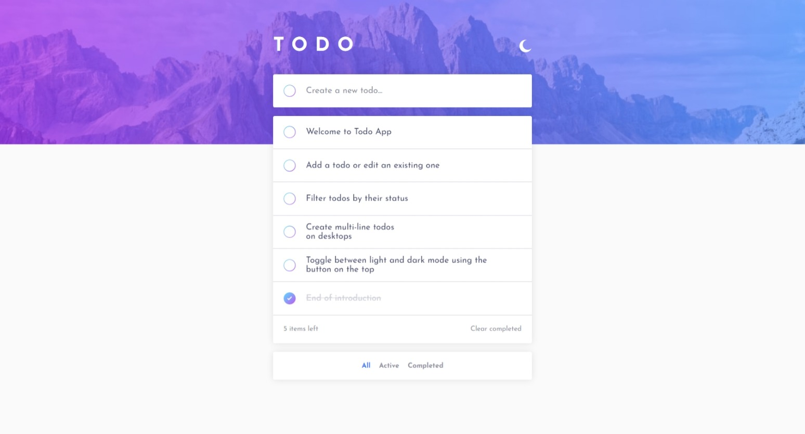
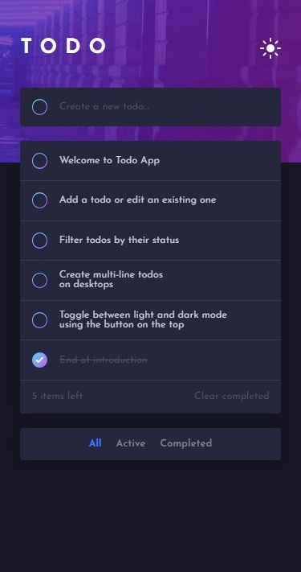

# Todo App

   

Welcome! This is a Todo app built for a coding challenge on [Frontend Mentor](https://www.frontendmentor.io)

[Experience it live](https://alimansoor-create.github.io/todo-app)

## Features

- Create, edit, and delete todos
- Toggle todo status and filter by status
- Toggle between light and dark theme
- Create multi-line todos on desktop using Shift+Enter
- Clear all completed todos
- Retains selected theme and todo list
- Installable as a Progressive Web App

## Built with

- React
- Redux
- Typescript
- styled-components
- Vite

## Screenshots

**Desktop**

**Mobile**

Do check the app out and leave your reviews [here]()!
